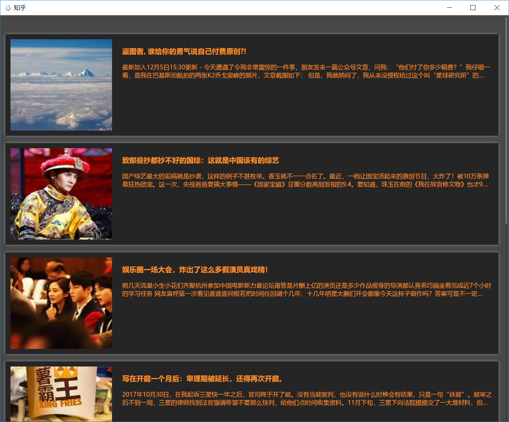
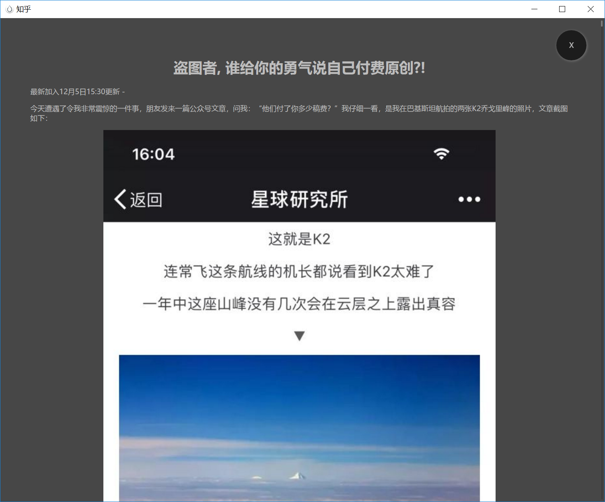

# ccc-plugin-boring
cocos creator 插件。有点无聊？看看知乎？

### 预览

### 使用

将该文件夹放入到 ~/.CocosCreator/packages（Windows 用户为 C:\Users\${你的用户名}\.CocosCreator\packages），或者放入到 ${你的项目路径}/packages 文件夹下即可完成扩展包的安装。

------

源码地址 https://github.com/potato47/ccc-plugin-boring

改编自 https://github.com/yohnz/Electron-build-tutorial